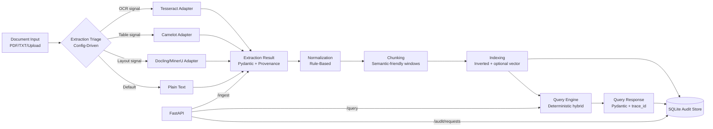

# Architecture Diagram

## Separation Of Concerns

- extraction: strategy routing + source parsing
- normalization: deterministic text cleanup
- chunking: provenance-preserving text segmentation
- indexing: lexical/vector index management
- querying: deterministic retrieval + configurable escalation
